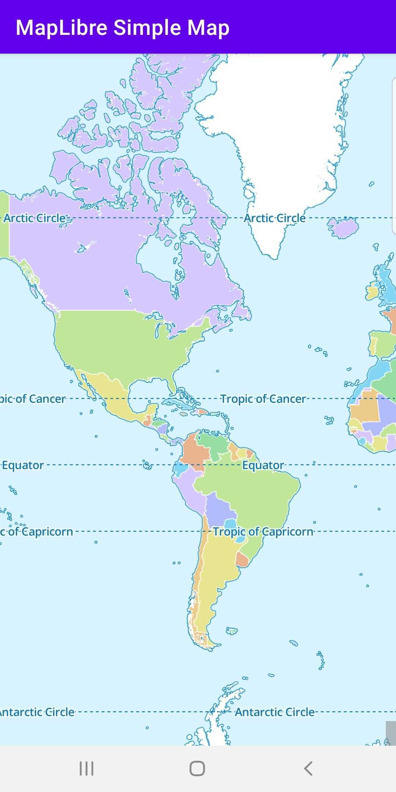

# MapLibre GL Native Android Example

An Android app to display a simple map using [MapLibre GL Native](https://github.com/maplibre/maplibre-gl-native).

## Usage

1. Install [Android Studio](https://developer.android.com/studio/install).
2. Clone this repository.
3. Open folder in Android Studio.
4. Press build.
5. Press run.

## Screenshot

## Credits

Forked from [Amazon Location Samples](https://github.com/aws-samples/amazon-location-samples).
